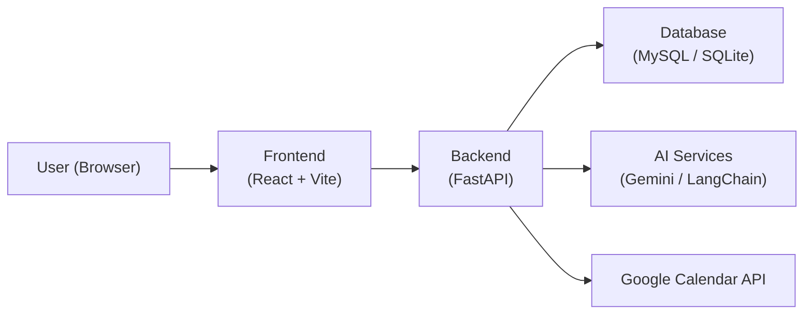

# Architecture

This document describes the high-level architecture of the Yashraj AI Assistant.

Components

- Frontend: React app built with Vite; calls backend API endpoints under `/api`.
- Backend: FastAPI app providing REST endpoints and business logic.
- Database: SQL database (MySQL in production, SQLite supported for local development).
- AI Services: Gemini / LangChain integrations for assistants and scheduling intelligence.
- External APIs: Google OAuth + Google Calendar for per-user calendar sync.
