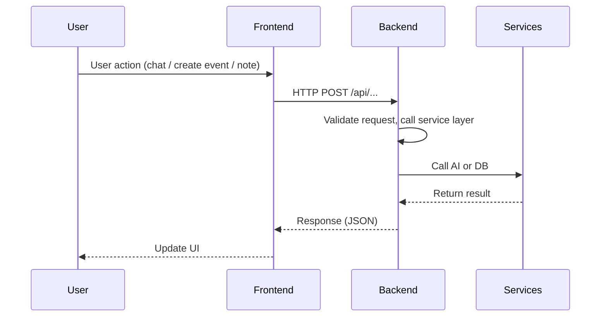

# System Flow

High-level request flow:

```mermaid
sequenceDiagram
  participant U as User
  participant F as Frontend
  participant B as Backend
  participant S as Services
  U->>F: User action (chat / create event / note)
  F->>B: HTTP POST /api/...
  B->>B: Validate request, call service layer
  B->>S: Call AI or DB
  S-->>B: Return result
  B-->>F: Response (JSON)
  F-->>U: Update UI
```

Notes

- Frontend is responsible for UX, optimistic updates, and managing API errors.
- Backend coordinates between AI, database, and external Google APIs.
